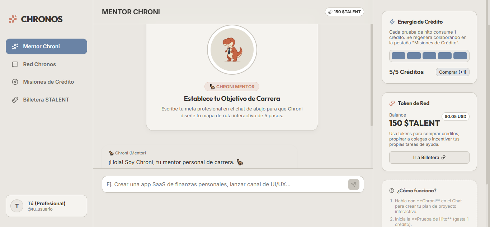
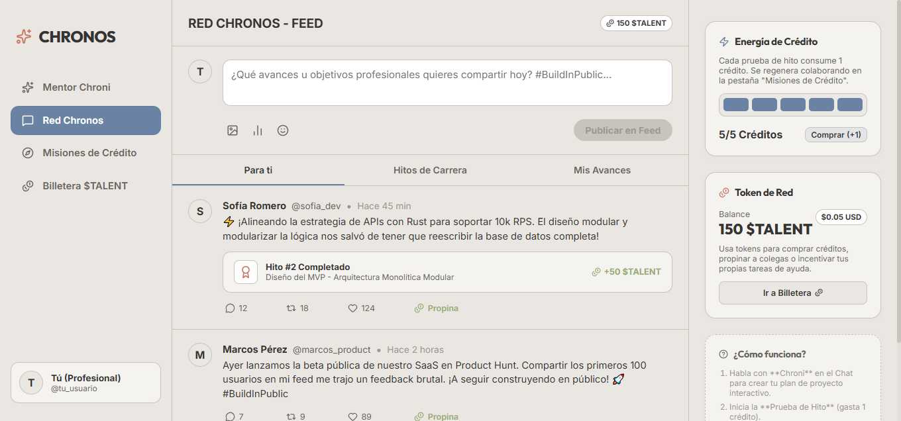
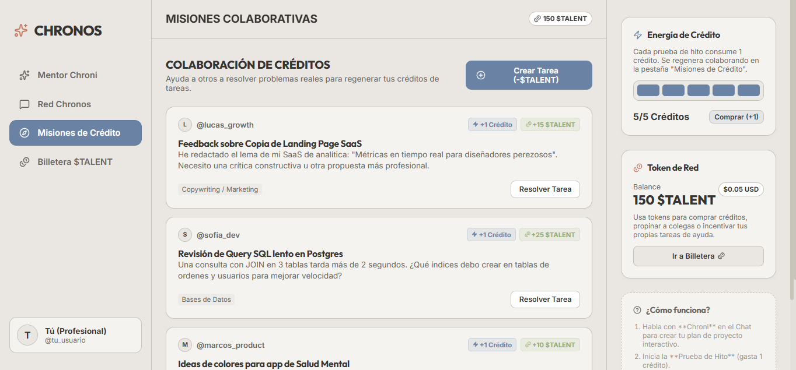
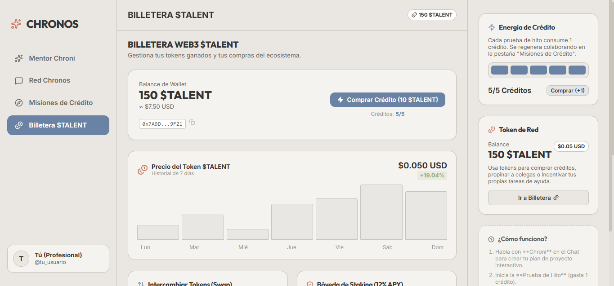

# 🦖 CHRONOS — Career Development & Collaborative Network

**CHRONOS** es una plataforma web interactiva de desarrollo profesional que combina mentoría gamificada, red social colaborativa y economía de tokens Web3. Guiada por **Chroni**, un dinosaurio mentor virtual, la aplicación transforma el crecimiento profesional en una experiencia interactiva tipo Duolingo pero orientada a la carrera.

## 🧠 ¿Cómo funciona?

CHRONOS se organiza en **4 módulos principales** que trabajan juntos:

### 1. Mentor Chroni — Roadmap Interactivo
El usuario conversa con Chroni (chatbot mentor) para definir un objetivo profesional. Chroni genera automáticamente un **roadmap de 5 hitos** con preguntas de evaluación. Cada hito completado consume **1 crédito** y recompensa con **tokens $TALENT**.

### 2. Red Chronos — Feed Social Profesional
Un feed tipo Twitter/X donde los usuarios comparten sus avances, dan propina en $TALENT a otros profesionales y muestran logros mediante tarjetas de hito insertadas en las publicaciones.

### 3. Misiones de Crédito — Tablero Colaborativo
Los usuarios publican tareas profesionales (revisión de código, feedback de diseño, etc.) y otros las resuelven para **regenerar sus créditos** y ganar tokens. Un sistema de economía peer-to-peer donde ayudar a otros te permite seguir avanzando.

### 4. Billetera $TALENT — Wallet Web3
Gestión completa de tokens: historial de transacciones, gráfico de precio simulado, intercambio (swap) a USD/Solana, y bóveda de staking con 12% APY.

---

## 📸 Screenshots y Casos de Uso

### Screenshot 1 — Mentor Chroni: Onboarding y Roadmap


| Problema | Solución Planteada | Solución Implementada |
|----------|-------------------|-----------------------|
| Los profesionales no saben por dónde empezar su desarrollo de carrera. Carecen de una estructura clara y motivación sostenida. | Crear un asistente interactivo tipo chatbot con apariencia amigable (mascota dinosaurio) que guíe al usuario paso a paso mediante un **roadmap gamificado de 5 hitos**. | Chroni conversa con el usuario, captura su objetivo profesional, y genera un roadmap con 5 hitos secuenciales. Cada hito tiene una pregunta de opción múltiple con análisis automático. El progreso se muestra visualmente con indicadores de estado (bloqueado/activo/completado). |

---

### Screenshot 2 — Red Chronos: Feed Profesional



| Problema | Solución Planteada | Solución Implementada |
|----------|-------------------|-----------------------|
| Falta un espacio donde los profesionales puedan compartir sus logros de desarrollo, recibir feedback y construir reputación dentro del ecosistema. | Diseñar una red social integrada donde cada hito completado genere automáticamente una publicación analítica. Incluir un sistema de **propina en tokens** para fomentar interacciones de calidad. | Feed completo con creación de posts, sistema de likes, reposts, comentarios, y tarjetas de logro insertadas automáticamente al completar hitos. Los usuarios pueden enviar propinas de 10 $TALENT a colegas, y hay filtros por tipo de contenido ("Para ti", "Hitos de Carrera", "Mis Avances"). |

---

### Screenshot 3 — Misiones de Crédito: Tablero Colaborativo



| Problema | Solución Planteada | Solución Implementada |
|----------|-------------------|-----------------------|
| Los usuarios se quedan sin créditos (máximo 5) y no pueden avanzar en su roadmap. Necesitan una forma de regenerarlos que tenga valor profesional. | Implementar un **tablero colaborativo** donde los usuarios publiquen problemas reales de su trabajo y otros los resuelvan a cambio de créditos + tokens. | Sistema completo con modal de creación de tareas (requiere invertir $TALENT como incentivo), modal de solución con recompensas (+1 crédito + tokens), y badges visuales de recompensa. Las tareas tienen categorías (Programación, Diseño UI/UX, Marketing, Bases de Datos). |

---

### Screenshot 4 — Billetera $TALENT: Web3 Wallet



| Problema | Solución Planteada | Solución Implementada |
|----------|-------------------|-----------------------|
| Los tokens ganados necesitan tener utilidad real. Sin un ecosistema de valor, los tokens pierden sentido y los usuarios no se motivan a ganarlos. | Construir una **billetera Web3 simulada** con funcionalidades reales: swap a USD/Solana, staking con rendimiento, y compra de créditos directamente desde la wallet. | Wallet con vista de balance total, gráfico de precio simulado de 7 días, intercambio $TALENT → USD / SOL, bóveda de staking al 12% APY, historial completo de transacciones con indicadores de entrada/salida, y compra directa de créditos (10 $TALENT por crédito). |

---

## 🏗️ Arquitectura Técnica

```
idea-de-negocio/
├── public/
│   └── mascot.png              # Mascota Chroni
├── src/
│   ├── components/
│   │   ├── AuraAgent.tsx       # Chat mentor + Roadmap + Desafíos
│   │   ├── SocialFeed.tsx      # Red social profesional
│   │   ├── TaskBoard.tsx       # Tablero de tareas colaborativas
│   │   └── CryptoWallet.tsx    # Billetera Web3 $TALENT
│   ├── App.tsx                 # Layout principal + estado global
│   ├── index.css               # Estilos globales (tema sand)
│   └── main.tsx                # Punto de entrada
├── docs/
│   └── screenshots/            # Capturas de pantalla
├── index.html
├── package.json
├── vite.config.ts
└── tsconfig*.json
```

### Stack Tecnológico

| Tecnología | Versión | Propósito |
|-----------|---------|-----------|
| React | 19.x | UI framework |
| TypeScript | 6.x | Tipado estático |
| Vite | 8.x | Build tool / dev server |
| Lucide React | 1.x | Iconos SVG |
| ESLint | 10.x | Linting |

### Patrones y Decisiones Técnicas

- **Estado Global en App.tsx**: Los estados compartidos (créditos, balance $TALENT, transacciones, posts) se manejan desde el componente `App.tsx` y se pasan como props a los hijos. Esto evita dependencias de librerías externas de estado y mantiene el flujo de datos explícito.
- **Componentes Puros**: Cada módulo (AuraAgent, SocialFeed, TaskBoard, CryptoWallet) es un componente independiente que recibe props y callbacks, facilitando testing y mantenimiento.
- **Sistema de Créditos Regenerables**: Lógica de economía circular — los créditos se consumen en desafíos, se regeneran ayudando a otros, y se pueden comprar con tokens.
- **Tema Visual "Sand"**: Paleta de colores cálidos tipo arena/terracota que evoca la era de los dinosaurios, con acentos en azul acero y verde musgo.

## 🚀 Cómo Empezar

```bash
# Clonar el repositorio
git clone https://github.com/tu-usuario/chronos.git
cd chronos

# Instalar dependencias
npm install

# Iniciar servidor de desarrollo
npm run dev

# Build para producción
npm run build

# Preview del build
npm run preview
```

## 📜 Licencia

MIT
